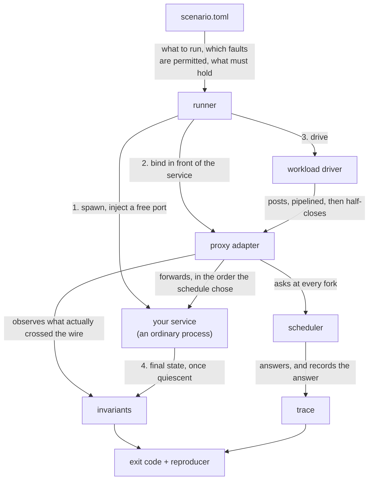
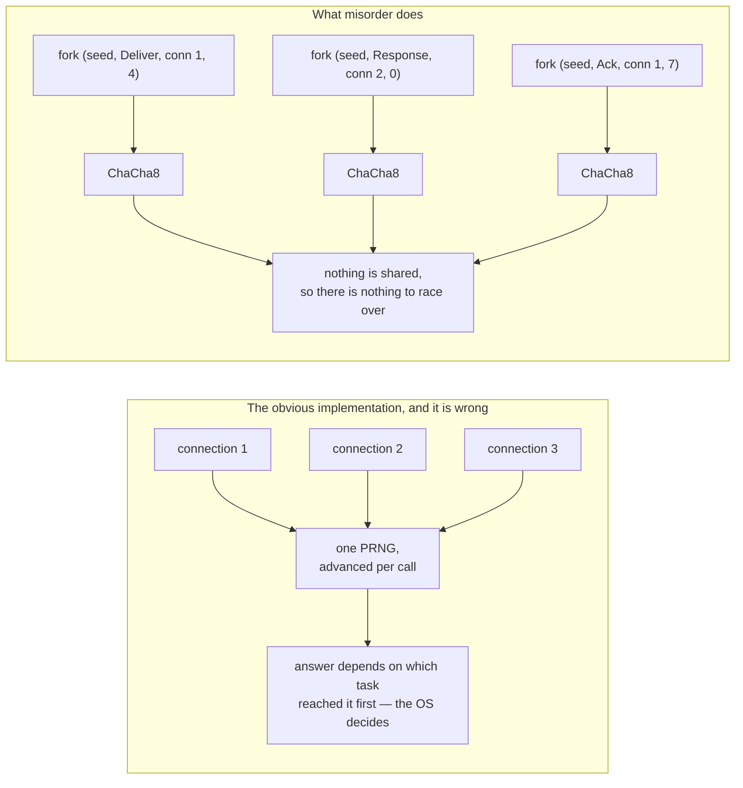
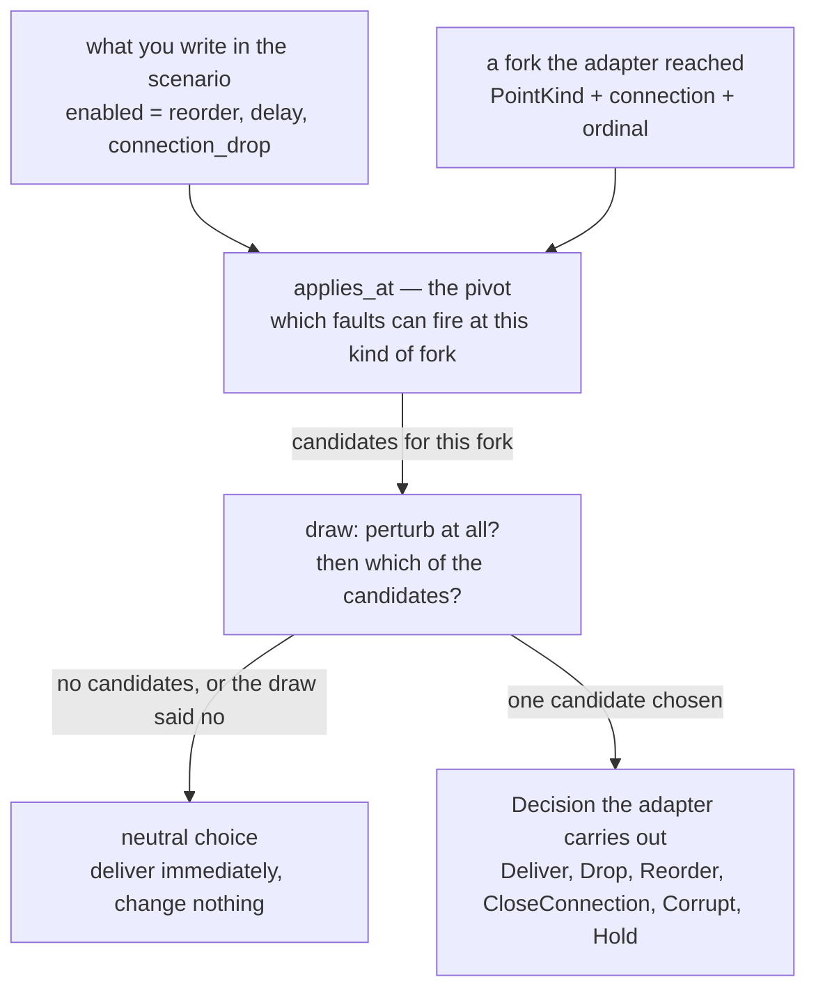
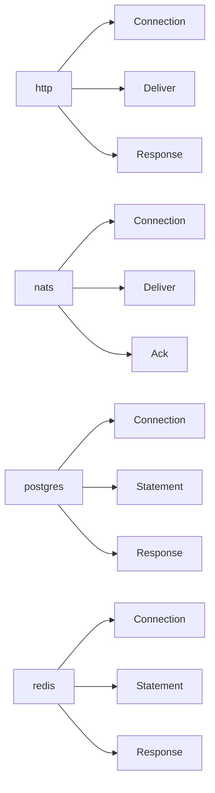
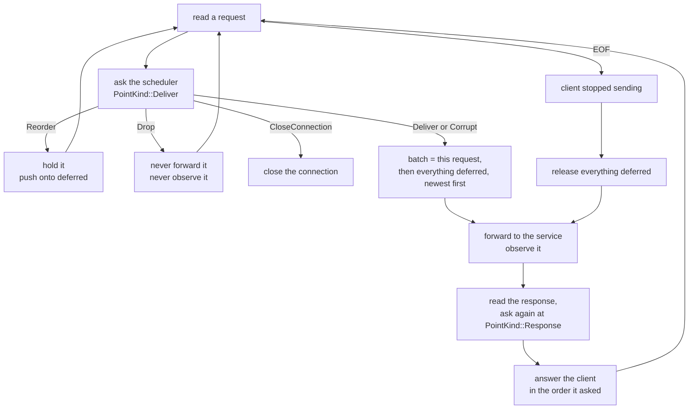
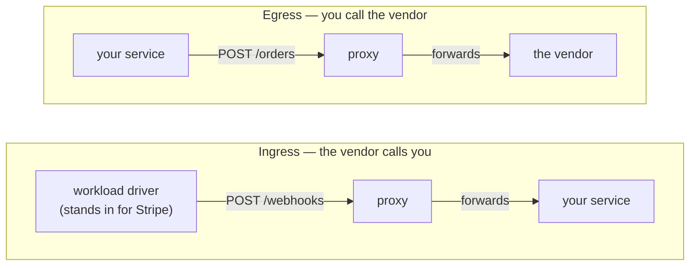
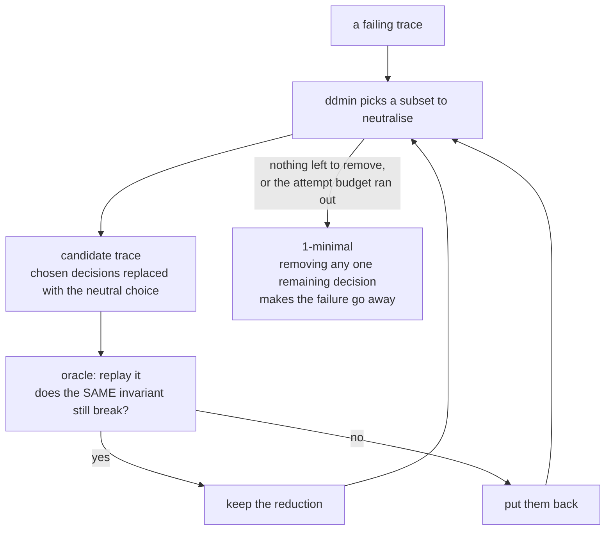
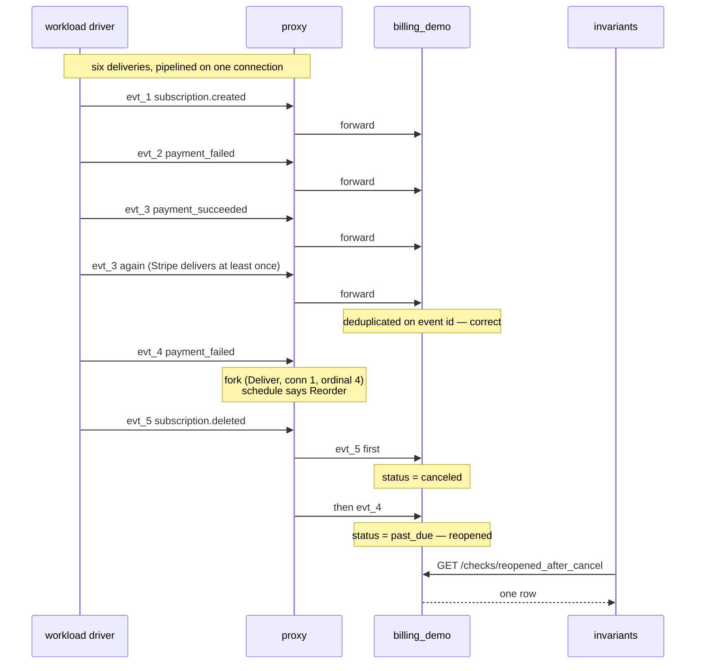
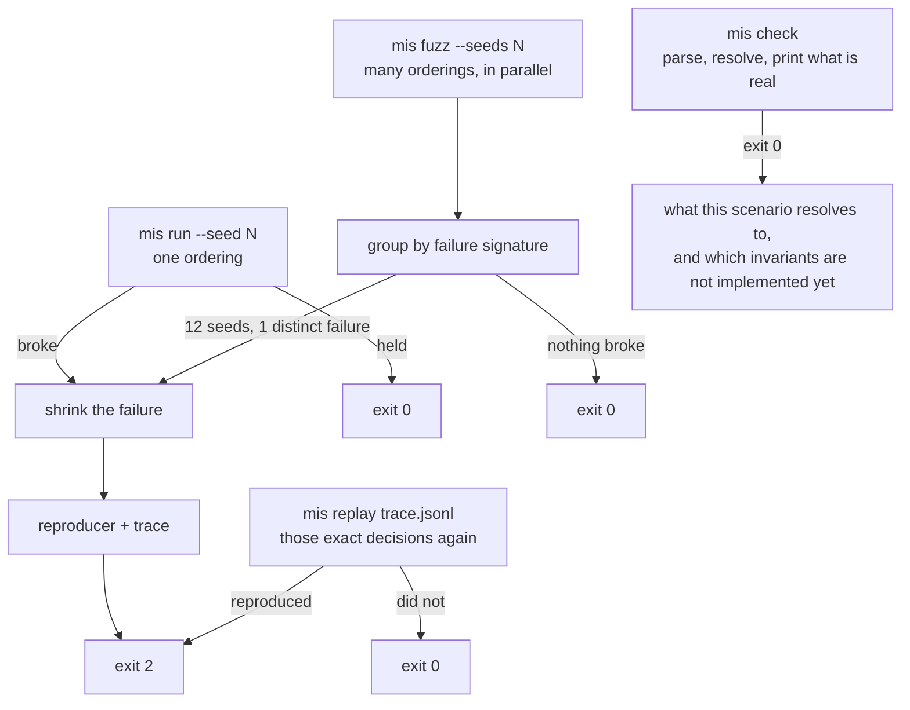

# Architecture

How the pieces fit, component by component.

[`INTERFACES.md`](INTERFACES.md) is the contract anything built on top reads and
writes. This document is the inside: what each component does, what it is
forbidden from doing, and where the seams are.

---

## 1. A run, end to end

Six stages, and the boundaries between them are where the design lives. The
order is load-bearing and is the same on every path through the tool.

**The service imports nothing.** It is spawned, handed a port through its
environment, and never told any of this is happening. That is the whole language
stance in one mechanism: a Go service and a Rust service are started
identically.

**The proxy binds after the service is listening and before any workload is
driven.** Bound earlier it would forward to a port nothing has opened; driven
earlier the first requests would bypass fault injection entirely and the run
would quietly test less than it claimed.

---

## 2. The scheduler

Every branch that could go two ways goes through here. This is the component the
tool's one promise rests on, so it is worth showing what it is *not*.

A run has several proxied connections being served at once. Drawing from one
sequential stream makes the schedule depend on task arrival order, so the same
seed produces a different run on a different machine — determinism becomes a
claim rather than a property, and the first reproducer that fails to reproduce
ends the tool.

So every fork derives **its own** generator from
`(seed, kind, connection, ordinal)`. Concurrency stops being able to affect the
answer.

ChaCha8 rather than the standard library's `StdRng` for a related reason:
`StdRng`'s algorithm is explicitly not stable across releases, so a dependency
bump would silently renumber every seed and invalidate every committed
reproducer in every user's repository.

---

## 3. The fault model

Faults are **not owned by adapters**. There is one flat `FaultKind` enum shared
by every protocol, and what varies is *where* each one can fire.

`ack_timeout` is protocol-*shaped* but not protocol-*owned*: it is constrained
to `PointKind::Ack`, and only the NATS adapter ever produces an `Ack` fork.
Write an AMQP adapter tomorrow, emit `Ack`, and it inherits `ack_timeout` and
`swallow_ack` for free.

Which fork kinds each adapter produces:

Redis was the test of that claim, and it passed: a whole new protocol needed no
new `PointKind` and no new fault. It did move one line — `reorder` now applies at
`Statement` as well, because Redis clients pipeline and two commands really can
be in flight at once. A table that reached only deliveries and responses would
have left that unexplored while a scenario naming `reorder` read as covering it.

Eight user-facing faults collapse into six decisions, because faults name
**intent** and decisions name **mechanism**. `swallow_ack` and `redelivery` are
both `Drop` — one loses the receipt on the way back, the other loses the message
on the way out.

Two safety nets stop a fault firing where it cannot be carried out: `applies_at`
filters candidates before the draw, and an adapter handed an impossible decision
errors loudly. A recorded fault that did not happen is the worst outcome
available, because the trace then describes a run nobody had.

---

## 4. Inside the proxy

One connection, served sequentially on purpose. Two tasks serving one connection
would race over the order requests reach the service, and that order is the
scheduler's to decide.

**A dropped request is never observed.** If a request misorder itself withheld
were reported, `every_request_reaches_terminal_state` would blame the service
for the harness's fault.

**The answers go back in the order the client asked**, even though the service
saw them reordered. Otherwise a pipelining client matches every response to the
wrong request. The service still saw the ordering the scheduler chose, which is
the whole object of the exercise.

**A reorder needs two requests in flight.** That is why the workload driver
sends without waiting and then shuts its write half: a deferred request is
released when a later one overtakes it, or when the client stops sending. A
driver that waited for each response would give every reorder nothing to swap
with, and a scenario permitting `reorder` would quietly explore none.

---

## 5. Ingress and egress

The same adapter, and the only thing that differs is which way the arrow points.

`Adapter::bind(upstream)` only ever means "where I forward to," so both
placements are the same code. What differs is configuration: an egress proxy
injects its own address into the service's environment, and an ingress proxy has
nothing to inject because the service is not the one connecting.

Today `mis run` wires ingress. Egress works when the engine is driven as a
library, but a scenario cannot declare an HTTP dependency yet, so there is no
scenario-file path to it.

---

## 6. Shrinking

847 decisions collapse to six. What shrinks is the **trace**, never the seed:
seeds 8837291 and 8837292 produce unrelated schedules, so there is no gradient
to descend and no meaning to a halfway point.

**Removing a decision does not delete the line.** It becomes the neutral choice:
the fork still happens and takes the boring path. That is what makes the output
readable as "this fault was available and was not needed," and it is why every
decision has a neutral counterpart by construction.

**The oracle matches on the specific invariant, not on "the run failed."** A
candidate that fails for a different reason is not this failure getting smaller,
and accepting it would make the search wander towards whichever bug is easiest
to trigger.

Delta debugging rather than a single greedy pass, because a greedy pass gets
stuck whenever two decisions are only redundant together: neither can go alone,
so neither goes.

---

## 7. The worked example, concretely

[`examples/stripe_invoice_lifecycle.toml`](../examples/stripe_invoice_lifecycle.toml)
against [`billing_demo`](../apps/demos/src/bins/billing.rs). One reorder, at one fork.

Only that one fork matters. A reorder at ordinal 0 puts `evt_2` before `evt_1`
and nothing breaks; at ordinal 5 the last delivery is deferred with nothing
following it, so it is released at close and arrives last anyway. Measured over
seeds 1–100: twenty-one seeds reorder *something*, four break the invariant, and
they are exactly the four that reorder at ordinal 4.

Neither `delay` nor `connection_drop` can produce it. `delay` changes when a
request is written, never the order — each request is answered before the next
is sent. `connection_drop` can only *prevent* the bug: drop `evt_5` and there is
no cancellation to violate.

---

## 8. The CLI

Four commands, and a three-valued exit code that is the whole CI integration.

| Code | Meaning |
| ---- | ------- |
| 0 | Every invariant held. |
| 1 | misorder could not run. **Not a finding.** |
| 2 | An invariant was violated. A finding. |

Collapsing 1 and 2 means a broken Docker socket looks like a caught bug, someone
chases it for an hour, and the next real finding gets the same treatment.

**Sweeps belong on a schedule; reproducers belong on every pull request.** Ten
thousand orderings is minutes and exists to find something new. A committed
shrunk trace runs in under a second and either reproduces or does not.
